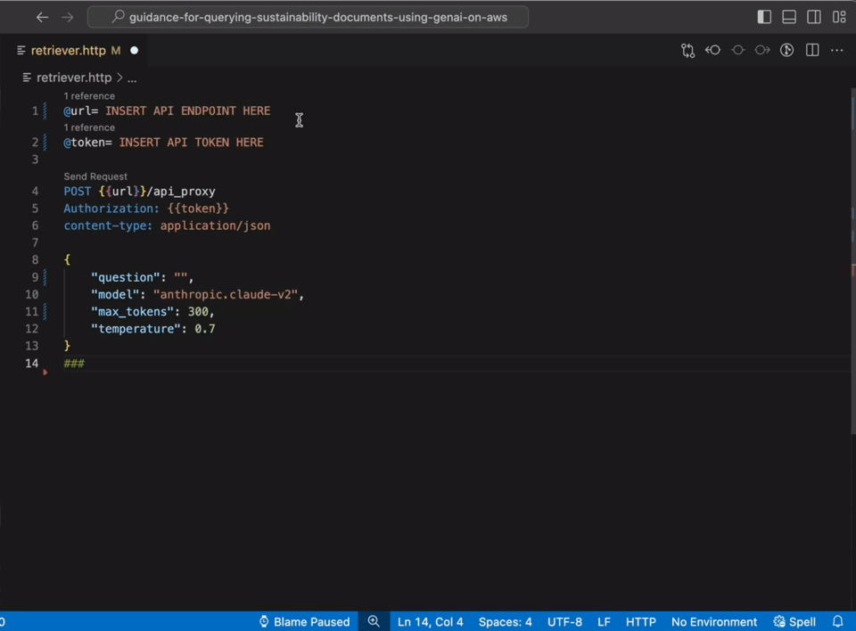
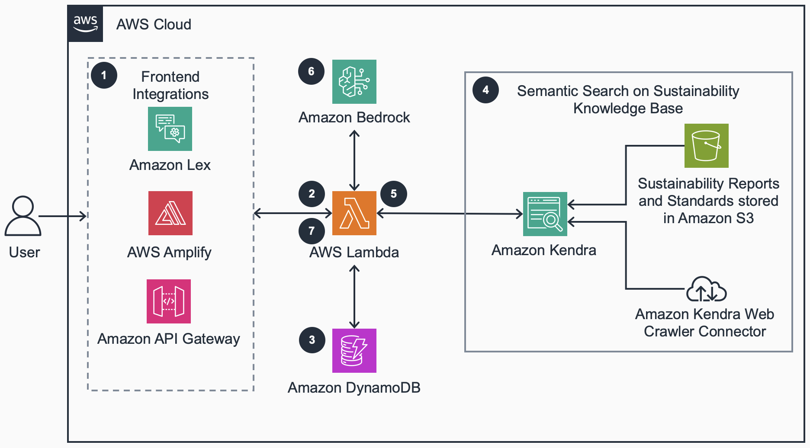

# Guidance for Querying Sustainability Documents Using Generative AI for ESG Reporting on AWS

**Table of Contents**

- [Overview](#overview)
  - [Capabilities and Key Benefits](#capabilities-and-key-benefits)
  - [Authors](#authors)
  - [Architecture Diagram](#architeceture-diagram)
  - [Cost](#cost)
- [Getting Started](#getting-started)
  - [Operating System and Third Party Packages](#operating-system-and-third-party-packages)
  - [AWS Account Requirements](#aws-account-requirements)
  - [Prerequisites](#prerequisites)
- [Deploy](#)
  - [Build the Infrastructure](#build-the-infrastructure)
  - [Run the Service](#run-the-service)
- [Cleanup](#cleaup)

# Overview

[This Guidance demonstrates](https://aws.amazon.com/solutions/guidance/querying-sustainability-documents-using-generative-ai-for-esg-reporting-on-aws/) how to implement a Retrieval-Augmented Generation (RAG) process for your authoritative knowledge base, specifically addressing environmental, social, and governance (ESG) requirements. 
It combines the capabilities of Amazon Kendra and a large language model (LLM) on Amazon Bedrock—a fully managed service offering a choice of high-performing foundation models.
This guidance uses the [AWS Cloud Development Kit (AWS CDK)](https://aws.amazon.com/cdk/) to deploy infrastruvture assets to build their sustainability large language model knowledge base and.

Designed to provide rapid insights from dense sustainability documents like corporate reports, regulatory filings, and standards, this guidance streamlines navigation of diverse ESG information. 
This allows you to rapidly analyze text data, summarize key insights, and draw conclusions for your ESG reporting needs.
Refer to [this section to see an example question](#3-example-result) and response generated with this guidance sample code.



## Authors

This project is built and maintained by [Marco Masciola](https://www.linkedin.com/in/marcomasciola/) and [Sundeep Ramachandran](https://www.linkedin.com/in/rsundeep/).

## Capabilities and Key Benefits

The following list covers current capabilities as of today:

* Accepts a PDF file in any format to create a knowledge base using [Amazon Kendra](https://aws.amazon.com/kendra/)
* Easily switch [Amazon Bedrock foundation models](https://docs.aws.amazon.com/bedrock/latest/userguide/models-supported.html) at runtime
* **Automated** infrastructure deployment using AWS CDk to reduce manual tasks and errors during deployment
* Built using serverless architecture to provide high **Scalability** and high availability, durability, and resilience
* OLicensed under Apache License Version 2.0 as an open source project
* Knowledge base can be triggered on a triggered 
* Authentication and authorization provided through [Amazon Cognito](https://aws.amazon.com/cognito/)

## Architecture Diagram



## Cost

This section is for a high-level cost estimate for deploying sample code in this guidance for the `us-west-2` region. 
This cost scenario assumes 5,000 API requests to estimate the cost for 1 month of usage with two [Amazon Bedrock foundation models](https://aws.amazon.com/bedrock/pricing/).

| AWS service  | Dimensions | Cost [USD] |
| ----------- | ------------ | ------------ |
| Amazon API Gateway | 5,000 requests, 34 KB request size | $1/month |
| Amazon Cognito | 10 users  | $1/month |
| AWS Lambda (query) | 5,000 requests, 128 MB memory allocation, 25 s duration | $1/month |
| AWS Lambda (S3 event trigger) | 5,000 requests, 128 MB memory allocation, 5 s duration | $1/month |
| Amazon DynamoDB | 1 GB storage  | $1/month |
| Amazon S3 | 10 GB standard storage  | $1/month |
| Amazon Bedrock (Claude 2.0 - option 1) | 200 input / 300 output tokens per request  | $44/month |
| Amazon Bedrock (Claude 3 Sonnet - option 2) | 200 input / 300 output tokens per request  | $26/month |
| Amazon Kendra Developer | 730 hours x 1.125 USD/hour | $821/month |

Note that the above estimate covers options for:

* Two foundation models: Claude 2.0 and Clause 3 Sonnet. More information is [covered here](https://aws.amazon.com/bedrock/pricing/) on the FM pricing model. 
* Amazon Kendra Developer and Enterprise edition. More information is [covered here](https://aws.amazon.com/kendra/pricing/) on the Kendra pricing model.

This cost model assumes the infrastructure is deployed over 1 month (730 hours). 
The limit costs, be sure to destroy the infrastructure after deployment as covered in the [cleanup section](#cleaup). 

# Getting Started

This Guidance uses AWS CDK. 
If you are using AWS CDK for first time, please perform the be sure to bootstrap your environment. 
In case you are using aws-cdk for the first time, you can refer to the [Getting started with AWS CDK](https://docs.aws.amazon.com/cdk/v2/guide/getting_started.html) guide. 

## Operating System and Third Party Packages

The instructions in this guidance can be run on Windows, OSx, and Linux operating systems. 
The following packages will need to be installed on your environment to deploy and run sample code provided in this guidance: 

* An IDE of your choice
* [Latest version of Python](https://www.python.org/downloads/)
* [Node.js](https://nodejs.org/en/learn/getting-started/how-to-install-nodejs) and [TypeScript](https://www.npmjs.com/package/typescript) are used for AWS CDK infrastructure deployment
* [jq](https://jqlang.github.io/jq/download/) command-line JSON parser to retrieve AWS services names

Must install one of the following options: 

* option 1 - [REST Client](https://github.com/Huachao/vscode-restclient/blob/master/README.md) (optional) to submit REST APIs through VS Code
* options 2 - [curl](https://curl.se/) to submit REST APIs from the command line

## AWS Account Requirements

IAM users must have permissions to deploy the stack using AWS CDK. Refer to the documentation [AWS Cloudformation permissions mechanisms](https://docs.aws.amazon.com/serverless-application-model/latest/developerguide/sam-permissions-cloudformation.html) learn which actions need to be granted to deploy the Infrastructure. 

Users will also need permission to deploy resources uses in this guidance, including the following: 

* Amazon API Gateway
* Amazon Cognito
* Amazon DynamoDB
* Amazon S3
* AWS Lambda

## Prerequisites

This sections lists steps required to configure the environment before deploying the infrastructure using AWS CDK. 
These steps include: 

* Cloning the repository for this guidance
* Configuring the python virtual environment and installing packages
* Installing node dependencies

#### 1 -Clone the Repository

```bash
git clone git@ssh.gitlab.aws.dev:sustainability-collab/genai-sus-autoreport.git
```

#### 2 - Configure Python Environment:

```bash
python -m venv .genai-env
source .genai-env/bin/activate
pip install -r requirements.txt
```

#### 3 - Install Node Dependencies

```bash
npm install i -D
```

# Deploy 

There are seven steps to deploy the sample code guidance in your AWS account. 
These steps involve:

1. Installing the Python dependencies to create the [Lambda layers](https://docs.aws.amazon.com/lambda/latest/dg/chapter-layers.html) deployed with the infrastructure
2. Bootstrapping CDK and deploying the infrastructure
3. Retrieve the stack resource name using [resource.sh](./resource.sh)
4. Create a user in Cognito authorized to access the API endpoint
5. Activate the Cognito user
6. Upload sustainability documents to your S3 bucket
7. Synchronize Kendra data source connector with documents uploaded in S3

Note that in step 7, the Kendra data source connect will need to be resynchronized each time a new document is uploaded into S3. 
Optionally, a [Kendra scheduled synchronize can be set up](https://docs.aws.amazon.com/kendra/latest/dg/data-source.html), but in this guidance the synchronization is trigger manually. 

## Build the Infrastructure

#### 1 - Build the Lambda layers

```bash
pip install -r src/lambda/requirements.txt --target ./src/libs/python --platform manylinux2014_aarch64 --only-binary=:all: --python-version 3.12 --implementation cp --upgrade
```

#### 2 - Deploy infrastructure

```bash
cdk bootstrap
cdk synth
cdk deploy --all --require-approval never
```

#### 3 - Retrieve from the stack resource names

Resource names are output during the `cdk deploy` step.
But you can retrieve resource names by running this command:

```bash
source resource.sh
```

* `S3AssetBucketName`
* `EndpointURL`
* `CognitoUserPoolID`
* `CognitoUserClientPoolID`
* `KendraIndexID`
* `KendraDataSourceID`

These resource ID's will be substituted in subsequent steps.

#### 4 - Create a user in AWS Cognito

Substitute the `CognitoUserPoolID` from the above step into the following command.
Define a `username` with one time `password` login credentials:

```bash
aws cognito-idp admin-create-user --user-pool-id <CognitoUserPoolID> --username <username> --temporary-password "<password>"
```

Make sure the password complexity meets the [policy requirements in auth.ts](src/infrastructure/lib/auth.ts#L48).

#### 5 - Activate a users in AWS Cognito

This step validates the user created in step 5:

```bash
aws cognito-idp admin-set-user-password --user-pool-id <CognitoUserPoolID> --username <username> --password "<password>" --permanent
```

The user status will transition from the 'pending' state to the 'confirmed' state.

#### 6 - Upload sustainability document to S3 assets bucket

Download the [IFRS Sustainability Standards and ESRS reconciliation](https://www.efrag.org/Assets/Download?assetUrl=%2Fsites%2Fwebpublishing%2FSiteAssets%2F22%2520Appendix%2520V%2520Comparison%2520of%2520IFRS%2520and%2520ESRS%25201%2520and%25202.pdf) table PDF document and save it to the folder `./assets/sust-resports`.
The downloaded file name should have `Comparison_of_IFRS_and_ESRS_1and_2.pdf`.
Nest, substitute `<S3AssetBucketName>` from step 4 in the following command and execute it:

```bash
aws s3 cp ./assets/sust-reports/Comparison_of_IFRS_and_ESRS_1and_2.pdf s3://<S3AssetBucketName>/corp-sust-reports/
```

This will upload the sustainability report into the S3 assets bucket.
This triggers a Lambda event to create the metadata file in `s3://<S3AssetBucketName>/metadata/corp-sust-reports/`

#### 7 - Synchronize Kendra Data Sources

Next, we will synchronize AWS Kendra Data Source with the Kendra Index by running:

```bash
aws kendra start-data-source-sync-job --id <KendraDataSourceID> --index-id <KendraIndexID>
```

The job will enter the `SYNCHING_INDEXING` state and will completed in a minutes.
You can check the job status by executing:

```bash
aws kendra list-data-source-sync-jobs --id <KendraDataSourceID> --index-id <KendraIndexID>
```

You are ready to proceed to the next step when `Status` is in the `SUCCEEDED` state.

## Run the Service

#### 1 - Authenticate and Generate JSON Web Token

A JW token must be generated to authenticate users before running the Q&A service.
This token, which has a 1 hour expiration by default, is generated using the [authentication service included in this repository](./auth/auth-service.ts):

```bash
npx ts-node auth/auth-service.ts --pool=<CognitoUserPoolID> --client=<CognitoUserClientPoolID> --username=<username> --password='<password>'
```

The `password` field should be included in quotes.

#### 2 (Option 1) - Execute REST API using REST Client

This option is for VS Code users with the [REST Client package](https://marketplace.visualstudio.com/items?itemName=humao.rest-client) installed. 
This workflow is exemplified in the gif provided in [Overview section](#overview). 
Open the file [retriever.http](retriever.http) and update line 1 to include the API Gateway endpoint `<EndpointURL>`.
Line 2 [retriever.http](retriever.http) should include the JW token generate in the previous step.
On line 10 you can ask a sustainability related question, such as:
 
* *"What is the IFRS standard for sustainability?"*
* *"How does IFRS S1 help investors with sustainability reporting?"*

Then click on the "Send Request" text above line 4 to submit the query. 
A new JSON response window should appear with a response generated from Amazon Bedrock using the PDF documents as the knowledge base for the query. 

#### 2 (Option 2) - Execute REST API using Curl

Alternatively, the `curl` command line tool can be used to submit a REST APi request. 
This request is submitted through the following command line instruction:

```bash 
curl -H 'content-type: application/json' \
  -H 'Authorization:<JWToken>' \
  -d '{"question": "How does IFRS S1 help investors with sustainability reporting?", "model": "anthropic.claude-v2", "max_tokens": 300, "temperature": 0.7 }' \
  -X POST \
  <EndpointURL>/api_proxy
```

In the above command line instruction, replace  `JWToken` with the authorization token provided in step 1 and the `EndpointURL` with the API address.
Be sure to terminate the `EndpointURL` with `api_proxy`. 

#### 3 Example Result

The response may vary depending on the Bedrock foundation model used, but a typical response expected for the question *"How does IFRS S1 help investors with sustainability reporting?"* may include a variation of the following: 

```bash 
{
    "uuid": "8c0e94bb-2a3e-4ec9-ba18-e5fab834483f", 
    "boto3_version": "1.34.49", 
    "kendra_index_id": "96bef2af-449d-43e4-9c70-e0ac0c3f5d26", 
    "answer": " Based on the provided context, IFRS S1 helps investors with sustainability 
        reporting in a few key ways:\n\n- It establishes overall sustainability-related 
        disclosure requirements that provide investors with consistent, comparable, and 
        reliable sustainability-related financial information. This makes it easier for 
        investors to incorporate sustainability considerations into their analysis and 
        decision-making.\n\n- It requires disclosure of material sustainability-related risks 
        and opportunities that affect enterprise value. This gives investors insight into 
        how sustainability issues may impact the financial performance and position of 
        companies.\n\n- It calls for disclosure of sustainability-related financial statement 
        metrics and related disclosures that are useful for assessing enterprise value. This 
        provides investors with quantified sustainability information that can be incorporated 
        into financial analysis models. \n\n- It sets requirements on where sustainability 
        disclosures should be located within the annual report package. Having disclosures in 
        consistent locations makes them easier for investors to find and compare.\n\n- Overall, 
        by promoting consistent, reliable and decision-useful sustainability reporting, IFRS S1 
        aims to help investors gain a more comprehensive understanding of enterprise value and 
        make better informed investment decisions. The requirements seek to meet the information 
        needs of investors who factor sustainability matters into their capital allocation 
        decisions."
}
```

The above JSON response included a UUID and Kendra index ID to for traceability and auditing purposed. 
The history of the full request transaction is recorded in the DynamoDB serviced provisioned in this guidance sample code. 

# Cleanup

The infrastructure is destroyed using the following command:

```bash
cdk destroy --all
```

The following services must be manually destroyed in the AWS console since the CDK stack retains certain services for auditing and data retention purposes:

* [S3 access logs bucket](https://s3.console.aws.amazon.com/s3/home?) prefixed by `sust-assets-logs-*`
* [DynamoDB table](https://us-west-1.console.aws.amazon.com/dynamodbv2/home?#tables)
* [Amazon Cognito](https://us-west-2.console.aws.amazon.com/cognito/v2/idp/user-pools?) user pools
